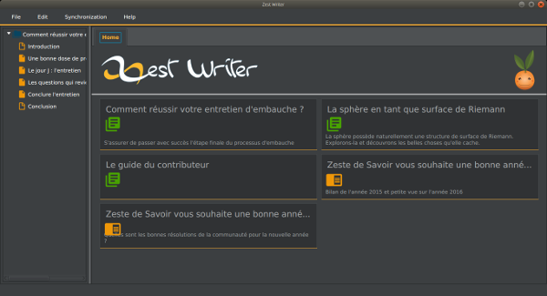
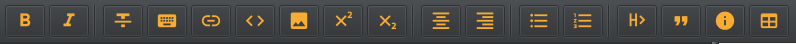
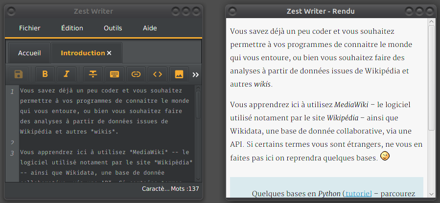
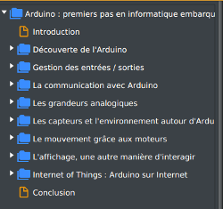
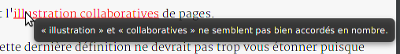
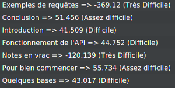
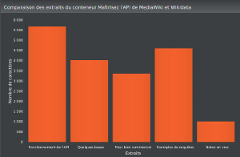

# Zest Writer

Un éditeur **hors-ligne** de contenus au format zMarkdown.

Linux | Windows
---|---
 | 

ZestWriter est un éditeur d'articles et de tutoriels en mode hors-ligne (sans avoir besoin d'une connexion internet). Il supporte la syntaxe zMarkdown (le Markdown avec les petits ajouts utilisés sur le site [Zeste de Savoir](https://zestedesavoir.com/)).

Pour la procédure d'installation ou des informations concernant le développement de ZestWriter, merci de consulter [la documentation officielle sur ReadTheDocs](http://zest-writer.readthedocs.io).

## Fonctionnalités

### Interface

**Général**

- différents thèmes proposés (clair, sombre, etc.) ;

**Zone d'édition**

- boutons d'aide à la rédaction Markdown (gras, italique, blocs spéciaux, tableaux, listes, etc.).

- possibilité de modifier la taille du texte et sa police ;

**Zone de rendu**

- prévisualisation instantanée lors de la rédaction ;
- décrochage de la zone de rendu dans une fenêtre externe afin de pouvoir la placer sur un écran séparé ;

**Arbre de navigation des contenus (tutoriels ou articles)**

- navigation à travers les différents conteneurs ;
- déplacement des conteneurs et des extraits par *drag'n drop* ;
- édition des titres des extraits et conteneurs.

### Révision

- proposition de corrections orthographiques, grammaticales et typographiques du contenu ;

- indices de lisibilité des extraits pour améliorer leur lisibilité (*Flesch* et *Gunning*) ;

- compteur de mots et de caractères affichés en temps réel ;
- graphiques de répartition du contenu dans les différents conteneurs.

### Synchronisation avec le site de Zeste de Savoir

- possibilité de récupérer ses contenus en rédaction sur le site ;
- possibilité d'envoyer sur le site les modifications effectuées sur Zeste Writer.

### Multiplateforme

- L'application fonctionne sur Windows, Linux et OS X.
